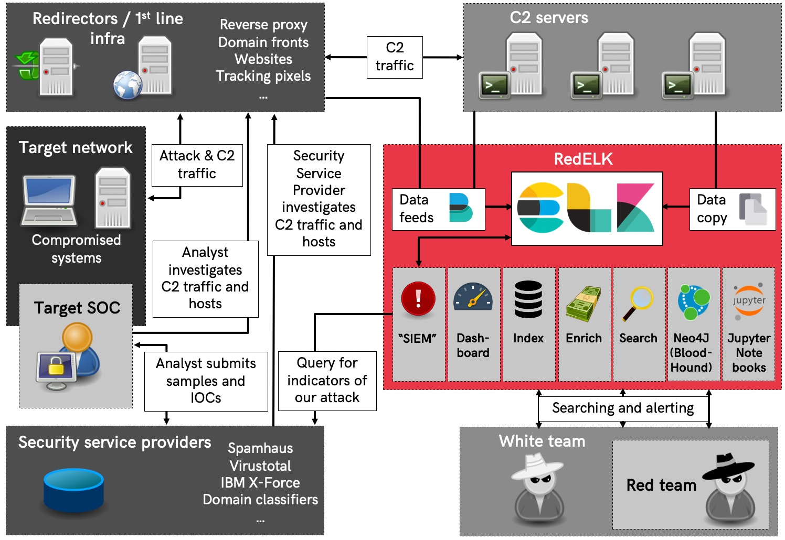

/badge.svg?branch=maindev)
/badge.svg?branch=maindev)
/badge.svg?branch=maindev)
/badge.svg?branch=maindev)
/badge.svg?branch=maindev)

Red Team's SIEM - tool for Red Teams for tracking and alarming about Blue Team activities as well as enhanced usability in long term operations.

1. **Enhanced usability and overview** for the red team operators by creating a central location where all relevant _operational_ logs from multiple teamservers are collected and enriched. This is great for historic searching within the operation as well as giving a read-only view on the operation (e.g. for the White Team). Especially useful for multi-scenario, multi-teamserver, multi-member and multi-month operations. Also, super easy ways for viewing all screenshots, IOCs, keystrokes output, etc. \o/
2. **Spot the Blue Team** by having a central location where all _traffic_ logs from redirectors are collected and enriched. Using specific queries its now possible to detect that the Blue Team is investigating your infrastructure.

# Background info #
Check the [wiki](https://github.com/outflanknl/RedELK/wiki) for info on usage or one the blog posts or presentations listed below:
- Blog part 1: [Why we need RedELK](https://outflank.nl/blog/2019/02/14/introducing-redelk-part-1-why-we-need-it/)
- Blog part 2: [Getting you up and running](https://outflank.nl/blog/2020/02/28/redelk-part-2-getting-you-up-and-running/)
- Blog part 3: [Achieving operational oversight](https://outflank.nl/blog/2020/04/07/redelk-part-3-achieving-operational-oversight/)
- SANS Hackfest 2020: Super charge your Red Team with RedELK [video](https://www.youtube.com/watch?v=24pVnDSSOLY) and [slides](https://github.com/outflanknl/Presentations/blob/master/SANSHackFest2020_Smeets_SuperchargeYourRedTeamwithRedELK.pdf)
- Hack in Paris 2019: Who watches the Watchmen [video](https://www.youtube.com/watch?v=ZezBCAUax6c) and [slides](https://github.com/outflanknl/Presentations/blob/master/HackInParis2019_WhoWatchesTheWatchmen_Bergman-Smeetsfinal.pdf)
- x33fcon 2019 Catching Blue Team OPSEC failures [video](https://www.youtube.com/watch?v=-CNMgh0yJag) and [slides](https://github.com/outflanknl/Presentations/blob/master/x33fcon2019_OutOfTheBlue-CatchingBlueTeamOPSECFailures_publicversion.pdf)
- BruCon 2018: Using Blue Team techniques in Red Team ops [video](https://www.youtube.com/watch?v=OjtftdPts4g) and [slides](https://github.com/outflanknl/Presentations/blob/master/MirrorOnTheWall_BruCon2018_UsingBlueTeamTechniquesinRedTeamOps_Bergman-Smeets_FINAL.pdf)

# Installation #
Check the [wiki](https://github.com/outflanknl/RedELK/wiki) for manual installation manual. There are also Ansible playbooks maintained by others:
- [RedELK Server playbook](https://github.com/fastlorenzo/redelk-server) - maintained by one of RedELK's developers
- [RedELK Client playbook](https://github.com/fastlorenzo/redelk-client) - maintained by one of RedELK's developers
- [ansible-redelk](https://github.com/curi0usJack/ansible-redelk) - maintained by curi0usJack/TrustedSec

# Conceptual overview #

Here's a conceptual overview of how RedELK works.

# Authors and contribution #
This project is developed and maintained by:
- Marc Smeets (@MarcOverIP on [Github](https://github.com/MarcOverIP) and [Twitter](https://twitter.com/MarcOverIP))
- Mark Bergman (@xychix on [Github](https://github.com/xychix) and [Twitter](https://twitter.com/xychix))
- Lorenzo Bernardi (@fastlorenzo on [Github](https://github.com/fastlorenzo) and [Twitter](https://twitter.com/fastlorenzo))

We welcome contributions! Contributions can be both in code, as well as in ideas you might have for further development, alarms, usability improvements, etc.
