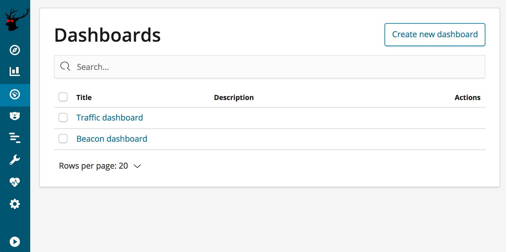
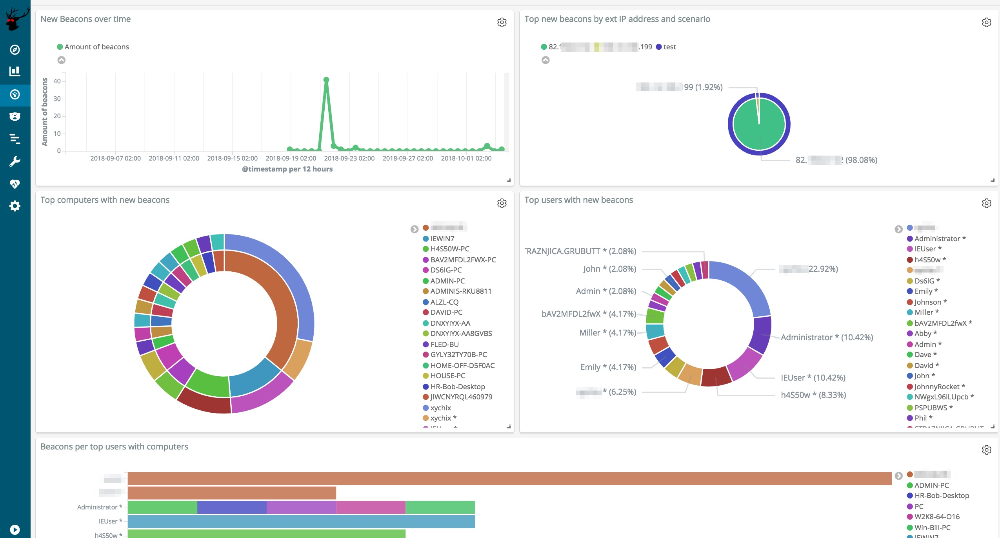
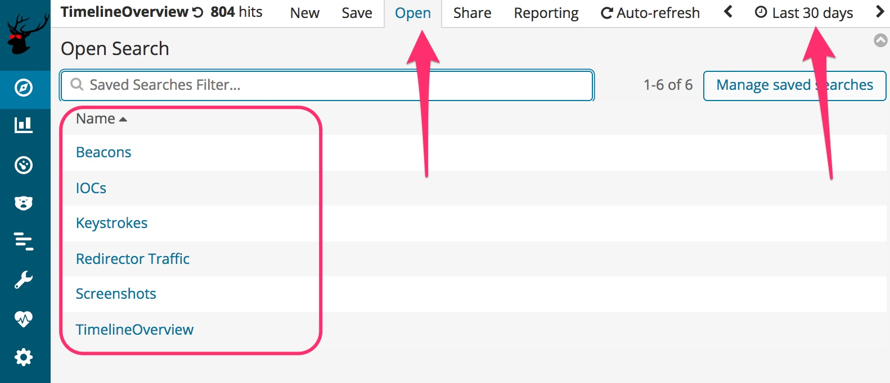
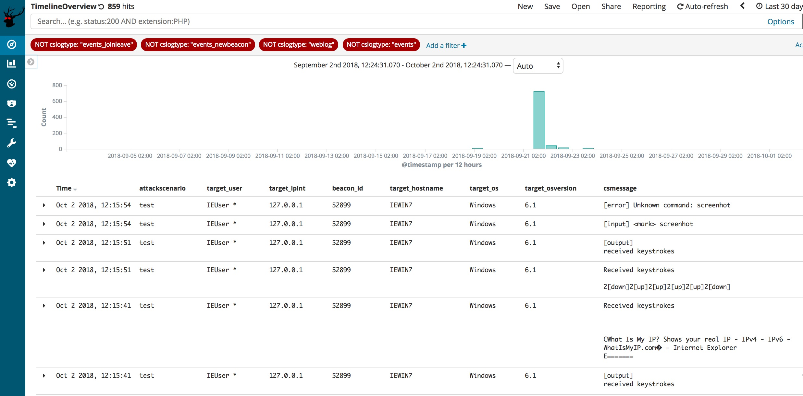
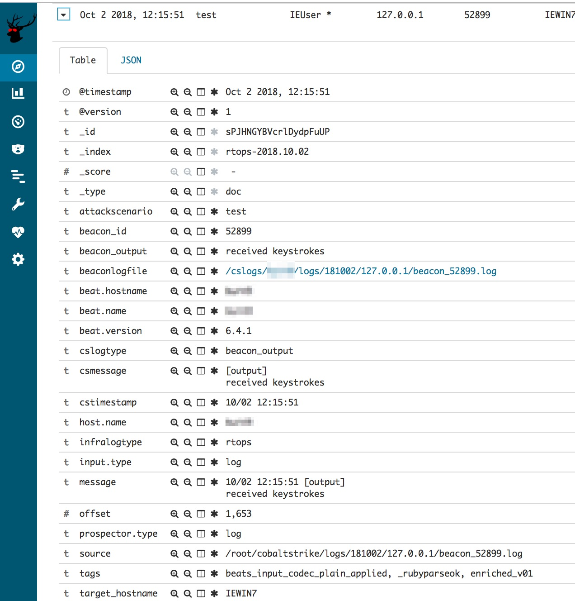
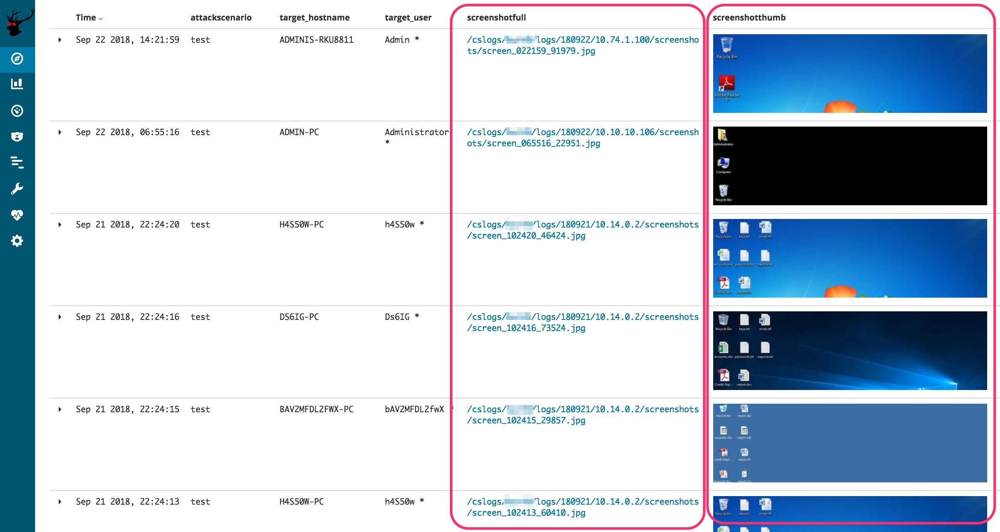
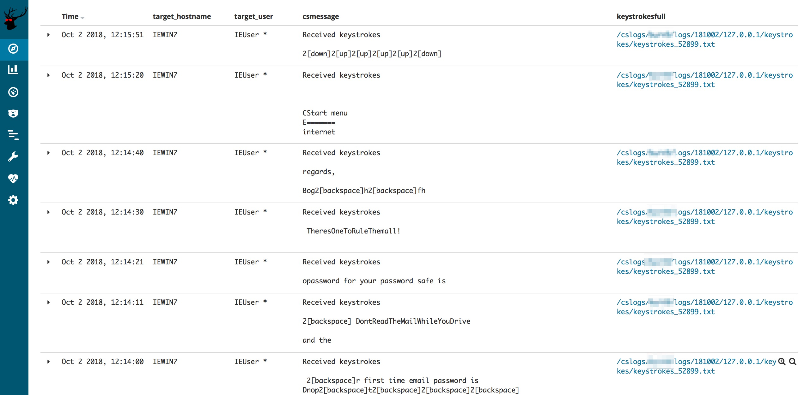
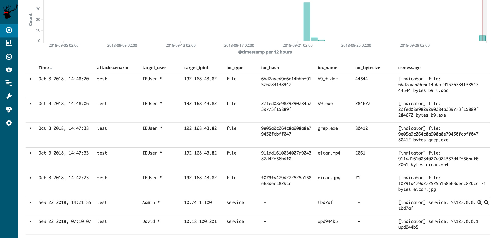

Red Team's SIEM - easy deployable tool for Red Teams used for tracking and alarming about Blue Team activities as well as better usability for the Red Team in long term operations.

# Goal of the project #
Short: a Red Team's SIEM.

Longer: a Red Team's SIEM that serves three goals:
1. **Enhanced usability and overview** for the red team operators by creating a central location where all relevant _operational_ logs from multiple teamservers are collected and enriched. This is great for historic searching within the operation as well as giving a read-only view on the operation (e.g. for the White Team). Especially useful for multi-scenario, multi-teamserver, multi-member and multi-month operations. Also, super easy ways for viewing all screenshots, IOCs, keystrokes output, etc. \o/
2. **Spot the Blue Team** by having a central location where all _traffic_ logs from redirectors are collected and enriched. Using specific queries its now possible to detect that the Blue Team is investigating your infrastructure.  
3. **Out-of-the-box usable** by being easy to install and deploy, as well as having ready made views, dashboards and alarms.

Here's a conceptual overview of how RedELK works.


RedELK uses the typical components Filebeat (shipping), Logstash (filtering), Elasticsearch (storage) and Kibana (viewing). Rsync is used for a second syncing of teamserver data: logs, keystrokes, screenshots, etc. Nginx is used for authentication to Kibana, as well as serving the screenshots, beaconlogs, keystrokes in an easy way in the operator's browser.

A set of python scripts are used for heavy enriching of the log data, and for for Blue Team detection.


# Supported tech and requirements #

RedELK currently supports:
- Cobalt Strike teamservers
- HAProxy for HTTP redirector data. Apache support is expected soon.
- Tested on Ubuntu 16 LTS

RedELK requires a modification to the default haproxy configuration in order to log more details.

In the 'general' section:
```
log-format frontend:%f/%H/%fi:%fp\ backend:%b\ client:%ci:%cp\ GMT:%T\ useragent:%[capture.req.hdr(1)]\ body:%[capture.req.hdr(0)]\ request:%r
```
At 'frontend' section:
```
declare capture request len 40000
http-request capture req.body id 0
capture request header User-Agent len 512
```


# Installation #

**First time installation**

Adjust `./certs/config.cnf` to include the right detials for the TLS certificates. Once done, run: `initial-setup.sh` This will create a CA, generate necessary certificates for secure communication between redirs, teamserver and elkserver and generates a SSH keypair for secure rsync authentication of the elkserver to the teamserver. It also generates `teamservers.tgz`, `redirs.tgz` and `elkserver.tgz` that contain the installation packages for each component.
Rerunning this initial setup is not required. But if you want new certificates for a new operation, you can simply run this again. 

**Installation of redirectors**

Copy and extract redirs.tgz on your redirector as part of your red team infra deployment procedures.
Run: `install-redir.sh $FilebeatID $ScenarioName $IP/DNS:PORT`

 - $FilebeatID is the identifier of this redirector within filebeat.
 - $ScenarioName is the name of the attack scenario this redirector is
   used for.
 - $IP/DNS:PORT is the IP or DNS name and port where filebeat
   logs are shipped to.

This script will set the timezone (default Europe/Amsterdam), install filebeat and dependencies, install required certificates, adjust the filebeat configuration and start filebeat.


**Installation of teamserver**

Copy and extract teamservers.tgz on your Cobalt Strike teamserver as part of your red team infra deployment procedures.
Run: `install-teamserver.sh $FilebeatID $ScenarioName $IP/DNS:PORT`
- $FilebeatID is the identifier of this teamserver within filebeat.
- $ScenarioName is the name of the attack scenario this teamserver is used for.
- $IP/DNS:PORT is the IP or DNS name and port where filebeat logs are shipped to.

This script will warn if filebeat is already installed (important as ELK and filebeat sometimes are very picky about having equal versions), set the timezone (default Europe/Amsterdam), install filebeat and dependencies, install required certificates, adjust the filebeat configuration, start filebeat, create a local user 'scponly' and limit that user to SSH key-based auth via scp/sftp/rsync.


**Installation of ELK server**

Copy and extract elkserver.tgz on your RedELK server as part of your red team infra deployment procedures.
Run: `install-teamserver.sh`
This script will set the timezone (default Europe/Amsterdam), install logstash, elasticsearch, kibana and dependencies, install required certificates, deploy the logstash configuration and required custom ruby enrichment scripts, download GeoIP databases, install Nginx, configure Nginx, create a local user 'redelk' with the earlier generated SSH keys, install the script for rsyncing of remote logs on teamservers, install the script used for creating of thumbnails of screenshots, install the RedELK configuration files, install crontab file for RedELK tasks, install GeoIP elasticsearch plugins and adjust the template, install the python enrichment scripts, and finally install the python blue team detection scripts.

You are not done yet. You need to manually enter the details of your teamservers in `/etc/cron.d/redelk`, as well as tune the config files in `/etc/redelk` (see section below). 

**Setting up enrichment and detection**

On the ELK server in the `/etc/redelk` directory you can find several files that you can use to tune your RedELK instance for better enrichments and better alarms. These files are:
- `/etc/redelk/iplist_customer.conf` : public IP addresses of your target, one per line. Including an address here will set a tag for applicable records in the redirhaproxy-\* index.
- `/etc/redelk/iplist_redteam.conf` : public IP addresses of your red team, one per line. Convenient for identifying testing done by red team members. Including an address here will set a tag for applicable records in the redirhaproxy-\* index.
- `/etc/redelk/iplist_unknown.conf` : public IP addresses of gateways that you are not sure about yet, but don't want to be warned about again. One per line.  Including an address here will set a tag for applicable records in the redirhaproxy-\* index.
- `/etc/redelk/known_sandboxes.conf` : beacon characteristics of known AV sandbox systems. One per line. Including data here here will set a tag for applicable records in the rtops-* index.
- `/etc/redelk/known_testsystems.conf` : beacon characteristics of known test systems. One per line. Including data here here will set a tag for applicable records in the rtops-* index.
- `/etc/redelk/alarm.json.config`: details required for alarms to work. This includes API keys for online services (Virus Total, IBM X-Force, etc) as well as the SMTP details required for sending alarms via e-mail.

If you alter these files prior to your initial setup, these changes will be included in the .tgz packages and can be used for future installations. These files can be found in `./RedELK/elkserver/etc/redelk`.

To change the authentication onto Nginx, change `/etc/nginx/htpasswd.users` to include your preferred credentials. Or `./RedELK/elkserver/etc/nginx/htpasswd.users` prior to initial setup.


# Under the hood #
If you want to take a look under the hood on the ELK server, take a look at the redelk cron file in `/etc/cron.d/redelk`. It starts several scripts in `/usr/share/redelk/bin/`. Some scripts are for enrichment, others are for alarming. The configuration of these scripts is done with the config files in `/etc/redelk/`. 
There is also heavy enrichment done (inlcuding the generation of hyperlinks for screenshtos, etc) in logstash. You can check that out direcly form the logstash config files in `/etc/logstash/conf.d/`.


# Current state  and features on todo-list #
This project is still in alpha phase. This means that it works on our machines and our environment, but no extended testing is performed on different setups. This also means that naming and structure of the code is still subject to change.

We are working (and you are invited to contribute) on the following features for next versions:
- **default index issue**. Automate the selection of the rtops-\* index as the default one in Kibana. This is a manual step at this moment.
- **Include the real external IP address of a beacon**. As Cobalt Strike has no knowledge of the real external IP address of a beacon session, we need to get this form the traffic index. So far, we have not found a true 100% reliable way for doing this. 
- **Support for Apache redirectors**. Fully tested and working filebeat and logstash configuration files that support Apache based redirectors. Possibly additional custom log configuration needed for Apache. Low priority.
- **Solve rsyslog max log line issue**. Rsyslog (default syslog service on Ubuntu) breaks long syslog lines. Depending on the CS profile you use, this can become an issue. As a result, the parsing of some of the fields are properly parsed by logstash, and thus not properly included in elasticsearch.
- **Ingest manual IOC data**. When you are uploading a document, or something else, outside of Cobalt Strike, it will not be included in the IOC list. We want an easy way to have these manual IOCs also included. One way would be to enter the data manually in the activity log of Cobalt Strike and have a logstash filter to scrape the info from there.
- **Ingest e-mails**. Create input and filter rules for IMAP mailboxes. This way, we can use the same easy ELK interface for having an overview of sent emails, and replies.
- **User-agent checks**. Tagging and alarming on suspicious user-agents. This will probably be divided  in hardcoded stuff like curl, wget, etc connecting with the proper C2 URL's, but also more dynamic analysis of suspicious user-agents.
- **DNS traffic analyses**. Ingest, filter and query for suspicious activities on the DNS level. This will take considerable work due to the large amount of noise/bogus DNS queries performed  by scanners and online DNS inventory services. 
- **Other alarm channels**. Think Slack, Telegram, whatever other way you want for receiving alarms.
- **Fine grained authorisation**. Possibility for blocking certain views, searches, and dashboards, or masking certain details in some views. Useful for situations where you don't want to give out all information to all visitors. 


# Usage #

**First time login**

Browse to your RedELK server's IP address and login with the credentials from Nginx (default is redelk:redelk). You are now in a Kibana interface. You may be asked to create a default index for kibana. You can select any of the available indices, it doesn't matter which one you pick.

There are probably two things you want to do here: look at dashboards, or look and search the data in more detail. You can switch between those views using the buttons on the left bar (default Kibana functionality).

### Dashboards ###
Click on the dashboard icon on the left, and you'll be given 2 choices: Traffic and Beacon. 







### Looking and searching data in detail ### 
Click on the Discover button to look at and search the data in more detail. Once there, click the time range you want to use and click on the 'Open' button to use one of the prepared searches with views.




**Beacon data**

When selecting the search 'TimelineOverview' you are presented with an easy to use view on the data from the Cobalt Strike teamservers, a time line of beacon events if you like. The view includes the relevant columns you want to have, such as timestamp, testscenario name, username, beacon ID, hostname, OS and OS version. Finally, the full message from Cobalt Strike is shown. 



You can modify this search to your liking. Also, because its elasticsearch, you can search all the data in this index using the search bar.

Clicking on the details of a record will show you the full details. An important field for usability is the *beaconlogfile* field. This field is an hyperlink, linking to the full beacon log file this record is from. Its allows you to look at the beacon transcript in a bigger windows and use CTRL+F within it.




**Screenshots**

RedELK comes with an easy way of looking at all the screenshots that were made from your targets. Select the 'Screenshots' search to get this overview. We added two big usability things: thumbnails and hyperlinks to the full pictures. The thumbnails are there to quickly scroll through and give you an immediate impression: often you still remember what the screenshot looked like.




**Keystrokes**

Just as with screenshots, its very handy to have an easy overview of all keystrokes. This search gives you the first lines of cententi, as well as again an hyperlink to the full keystrokes log file.




**IOC data**

To get a quick list of all IOCs, RedELK comes with an easy overview. Just use the 'IOCs' search to get this list. This will present all IOC data from Cobalt Strike, both from files and from services. 



You can quickly export this list by hitting the 'Reporting' button in the top bar to generate a CSV of this exact view.


**Logging of RedELK**

During installation all actions are logged in a log file in the current working directory.

During operations, all RedELK specific logs are logged on the ELK server in `/var/log/redelk`. You probably only need this for troubleshooting.


# Authors and contribution #
This project is developed and maintained by:
- Marc Smeets (@smeetsie on Github and @mramsmeets on Twitter).
- Mark Bergman (@xychix on Github and Twitter)

We welcome contributions! Contributions can be both in code, as well as in ideas you might have for further development, alarms, usability improvements, etc. 
