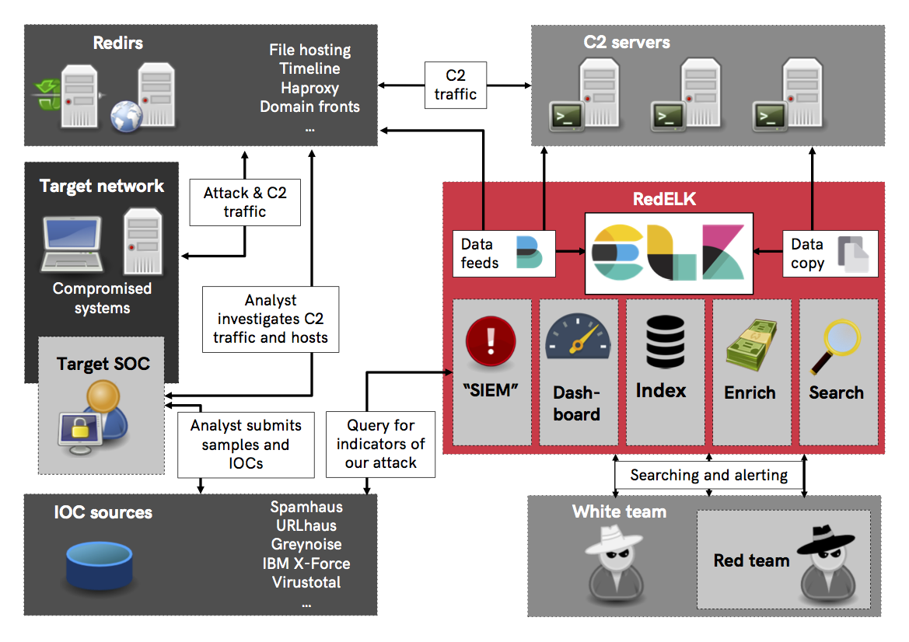

Red Team's SIEM - easy deployable tool for Red Teams used for tracking and alarming about Blue Team activities as well as better usability for the Red Team in long term operations.

Initial public release at BruCON 2018:
- Video: https://www.youtube.com/watch?v=OjtftdPts4g
- Presentation slides: https://github.com/outflanknl/Presentations/blob/master/MirrorOnTheWall_BruCon2018_UsingBlueTeamTechniquesinRedTeamOps_Bergman-Smeets_FINAL.pdf

Detailed reasoning for why we need such tooling in our blog post: https://outflank.nl/blog/2019/02/14/introducing-redelk-part-1-why-we-need-it/

# Goal of the project #
Short: a Red Team's SIEM.

Longer: a Red Team's SIEM that serves two goals:
1. **Enhanced usability and overview** for the red team operators by creating a central location where all relevant _operational_ logs from multiple teamservers are collected and enriched. This is great for historic searching within the operation as well as giving a read-only view on the operation (e.g. for the White Team). Especially useful for multi-scenario, multi-teamserver, multi-member and multi-month operations. Also, super easy ways for viewing all screenshots, IOCs, keystrokes output, etc. \o/
2. **Spot the Blue Team** by having a central location where all _traffic_ logs from redirectors are collected and enriched. Using specific queries its now possible to detect that the Blue Team is investigating your infrastructure.  

Here's a conceptual overview of how RedELK works.

# Authors and contribution #
This project is developed and maintained by:
- Marc Smeets (@MarcOverIP on Github and Twitter)
- Mark Bergman (@xychix on Github and Twitter)

We welcome contributions! Contributions can be both in code, as well as in ideas you might have for further development, alarms, usability improvements, etc. 

# Current state  and features on todo-list #
This project is still in beta phase. This means that it works on our machines and our environment, but no extended testing is performed on different setups. This also means that naming and structure of the code is still subject to change.

We are working (and you are invited to contribute) on many things, amongst others:
- **Include the real external IP address of a beacon**. As Cobalt Strike has no knowledge of the real external IP address of a beacon session, we need to get this form the traffic index. So far, we have not found a true 100% reliable way for doing this. 
- **Support for Apache and Nginx redirectors**. Fully tested and working filebeat and logstash configuration files that support Apache and Nginx based redirectors.
- **Solve rsyslog max log line issue**. Rsyslog (default syslog service on Ubuntu) breaks long syslog lines. Depending on the CS profile you use, this can become an issue. As a result, the parsing of some of the fields are properly parsed by logstash, and thus not properly included in elasticsearch.
- **Ingest manual IOC data**. When you are uploading a document, or something else, outside of Cobalt Strike, it will not be included in the IOC list. We want an easy way to have these manual IOCs also included. One way would be to enter the data manually in the activity log of Cobalt Strike and have a logstash filter to scrape the info from there.
- **Ingest e-mails**. Create input and filter rules for IMAP mailboxes. This way, we can use the same easy ELK interface for having an overview of sent emails, and replies.
- **User-agent checks**. Tagging and alarming on suspicious user-agents. This will probably be divided  in hardcoded stuff like curl, wget, etc connecting with the proper C2 URL's, but also more dynamic analysis of suspicious user-agents.
- **DNS traffic analyses**. Ingest, filter and query for suspicious activities on the DNS level. This will take considerable work due to the large amount of noise/bogus DNS queries performed  by scanners and online DNS inventory services. 
- **Other alarm channels**. Think Slack, Telegram, whatever other way you want for receiving alarms.
- **Fine grained authorisation**. Possibility for blocking certain views, searches, and dashboards, or masking certain details in some views. Useful for situations where you don't want to give out all information to all visitors. 

# Donation
Do you really like this project, or did it save you time and/or money? You may support us and send your donation to:
- BTC: 13h1mEkNUjy4PBUnHzG7sMDmbHtv9EUcds
- LTC: LiXDkcLhwa2mhs2qdkEbceznpMPDzWRZx5
